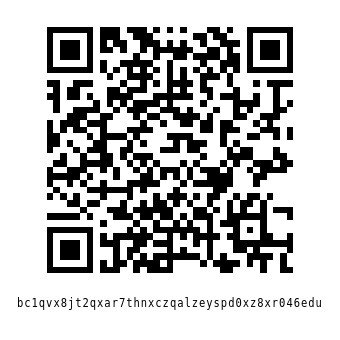

# Digital Min/Max Thermometer

# Introduction

The following project holds all the required files, and information to build a
battery powered digital min/max thermometer.

## Scope

The project is intended to be simple, reliable, and cheap by design; minimalist,
predictable use is the focus.

## Directory Guide

- [Electronics (PCB, etc.)](./electronics)
- [Hardware (Case, etc.)](./hardware)
- [Firmware](./firmware)

## Donations

Monero (XMR): `8BG1wFgq4fTKhekEh58Ae1M1ShGUsp15yFXJUuCXYQiFKUmDuQ9BK8tTfUfvXV2WR1CPE5Ry6DY45DmdDQm3SiCY7Jkw5ws`

Click to show XMR QR-Code

Bitcoin (BTC): `bc1qvx8jt2qxar7thnxczqalzeyspd0xz8xr046edu`

Click to show BTC QR-Code

