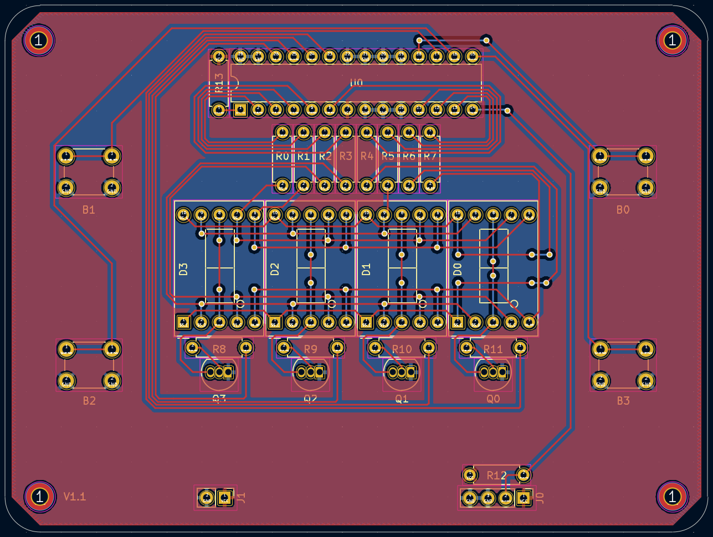

# PCB

## Introduction

This is the directory for the main PCB for the digital min/max thermometer. 

## Directory Map

- [Reference, and manufacturing/assembly information](./resources)
- [Gerber files](./gerbers)
- [PCB Schematic PDFs](./schematics)
- [Files relating to the design software](./project-files)

## Images

